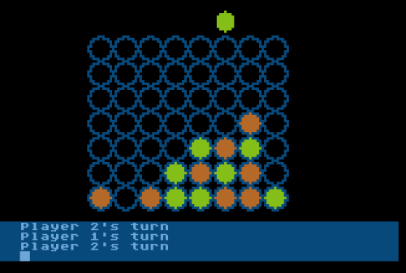

# 10line-2016-Connect4
Connect Four game in Turbo BASIC XL for Atari 8-bit. Entry for 2016 10-line BASIC contest

My third entry in the 2016 10-line BASIC program contest is CONNECT4, a board game for two players. Once again I used the TurboBASIC XL Parser Tool to create the minimized BASIC file - the “long lines” version I submitted weighs in at 8 lines, putting in the extended line lengths category. I managed to get the the 120-character-per-line version created by the tool down to 11 lines, but frankly I feel kind of done with this one, so I’m going to call it done rather than trying to squish it down to 120-character “pure” lines.

If anything, I’d add to the program the ability to have a computer opponent, but I just don’t think I can do it in the space I have left. At one point in this little program’s development, when I had the board and the logic of identifying wins, I knew I had room to add player-missile graphics for the piece dropping, or a computer opponent, but not both. I went for the pretty graphical effect.

Line-by-line code explanation is at https://atariaction.tumblr.com/post/138643299097/connect4

Sometime later, I made a version of the game that works across a network using the [FujiNet](https://fujinet.online) network adapter. Added that version to the repo.
